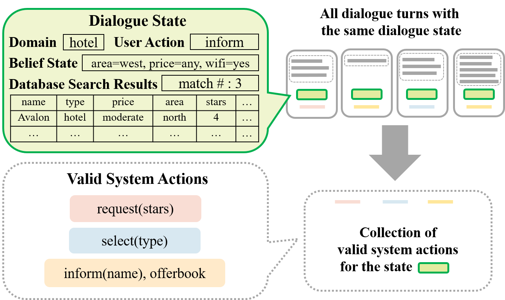

# DAMD-MultiWOZ
This is the code and data for AAAI 2020 paper "Task-Oriented Dialog Systems that Consider Multiple Appropriate Responses under the Same Context". [[paper link]](https://arxiv.org/abs/1911.10484) 


## Requirements
- Python 3.6
- PyTorch 1.0
- spaCy

We use the tokenization tool in SpaCy which can be installed through:
```
python -m spacy download en_core_web_sm
```

## Data Preprocessing
The original data files are put under data/multi-woz, which includes:
- data.json: The orignal MultiWOZ 2.0 data released by researchers in University of Cambridge available [here](https://github.com/budzianowski/multiwoz)
- annotated_user_da_with_span_full.json: A preprocessed and fully annotated version of MultiWOZ 2.0 data released by developers of Convlab available [here](https://github.com/ConvLab/ConvLab/tree/master/data/multiwoz/annotation)

Get ready for preprocessng:
```
python data_analysis.py
```
Data preprocessing: Normalization, utterance delexicalization and conversion of original dialog state/action labels to text-span form. Our implementation details are available [here](./data/multi-woz/README.md). 
```
python preprocess.py
```


## Multi-Action Data Augmentation (MADA)
Run our data augmentation algorithm to obtain additional valid state-action mappings:
```
python state_act_mapping.py
```

The overview of the MADA procedure:
<p align="center">

</p>


## Model: Domain Aware Multi-Decoder (DAMD) Network

The overview of our model structure:
<p align="center">

</p>

DAMD is an end-to-end model designed to handle the multi-domain response generation problem through leveraging our multi-action data augmentation framework. There are one encoder that encodes dialog context and three decoders that decodes belief span, system action span and system response respectively.

### Model ablations
- When **enable_aspn=False**, the action span decoder is disabled and the model reduces to a multi-domain version of the Sequicity model ([paper](https://www.comp.nus.edu.sg/~kanmy/papers/acl18-sequicity.pdf) & [code](https://github.com/WING-NUS/sequicity)), denoted as MD-Sequicity. 
- When **enable_bspn=False**, the belief span decoder and action span decoder are disabled and the model reduces to a Seq2Seq model with [copy mechanism](https://arxiv.org/abs/1603.06393). 
- When **bspn_mode=bspn** (enable_bspn=True as precondition), the model tracks both the slot and values in user utterance. For evaluation, the tracked dialog state can be used for database search if you set enable_dst=True, otherwise the ground truth dialog state will be used.  
- When **bspn_mode=bsdx** (enable_bspn=True as precondition), the model tracks only the slot mentioned by user. For evaluation, the ground truth dialog state of MultiWOZ is used for database search. 

## Training

Our implementation supports training on CPU or a single GPU. Please use smaller batch sizes if out-of-memory error raises. 

### Normal training without data augmentation
```
python model.py -mode train -cfg seed=333 cuda_device=0 exp_no=no_aug batch_size=128 multi_acts_training=False
```

### Training with data augmentation

```
python model.py -mode train -cfg seed=777 cuda_device=0 exp_no=aug_sample3 batch_size=80 multi_acts_training=True multi_act_sampling_num=3
```
We recommend to set multi_act_sampling_num=3. Please refer to the framework introduction section in our paper to see explainations about this setting. 


## Evaluation

### Single-response generation
```
path='YOUR_EXPERIMENT_PATH'
python model.py -mode test -cfg cuda_device=0 eval_load_path=$path aspn_decode_mode=greedy
```
Note that under this setting our model is comparable to other models in the MultiWOZ context-to-response generation benchmark (Table 2 in our paper). 

### Multi-response generation

```
path='YOUR_EXPERIMENT_PATH'
python model.py -mode test -cfg cuda_device=0 eval_load_path=$path aspn_decode_mode=beam beam_diverse_param=0.2 beam_width=5 nbest=5
python model.py -mode test -cfg cuda_device=0 eval_load_path=$path aspn_decode_mode=topk_sampling topk_num=3 nbest=5
python model.py -mode test -cfg cuda_device=0 eval_load_path=$path aspn_decode_mode=nucleur_sampling nucleur_p=0.9 nbest=5
```
Generation results are saved in result.csv under the experiment path. Note that only generated system actions are saved and the system action that overlaps most with the ground truth system action is selected for response generation. Automatic metrics of this response is reported, which can be used to show whether our model captures the reference action in the dataset within the multiple actions generated. However, since this response is generated with an access to the ground truth system action, the scores are meaningless themselves. 

Set **record_mode=True** to save all the multiple responses generated by each system action. The responses are saved in dialogue_record.csv.


### Evaluation settings
- use_true_pv_resp: use the ground truth previous turn's response as model input.
- use_true_prev_bspn: use the ground truth previous turn's belief span as model input.
- use_true_prev_aspn: use the ground truth previous turn's action span as model input.
- use_true_curr_bspn: use the ground truth current turn's belief span to guide belief span generation, by feeding the oracle token instead of the generated token to predict the next token. 
- use_true_curr_aspn: use the ground truth current turn's belief span to guide action span generation, by feeding the oracle token instead of the generated token to predict the next token. 
- use_true_bspn_for_ctr_eval: use the ground truth belief state to perform database search.
- use_true_db_pointer: use the ground truth database search results as model input.

Note that the downstream decoders take the hidden states of front decoder as input. Feeding ground truth labels can eliminate the influence of errors made by intermediate decoders. Refer to Table 2 in our paper to see results under different evaluation settings. 


### Reproducibility

We release the best model we obtained through training with data augmentation. Set the following path to evaluate it. 
```
path='experiments/all_no_aug_sd999_lr0.005_bs128_sp5_dc3'
```
Note that the automatic metric scores are not exactly equal to scores in our paper, due to we report the average scores of 5 independent runs instead of the released model. 


## Bug Report
Feel free to create an issue or send email to zhangyic17@mails.tsinghua.edu.cn